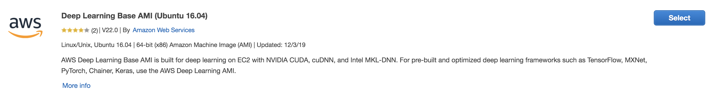
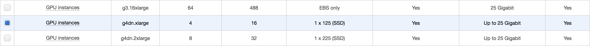
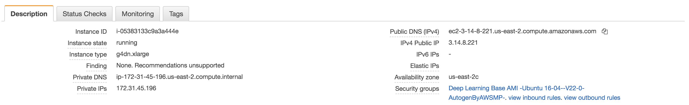
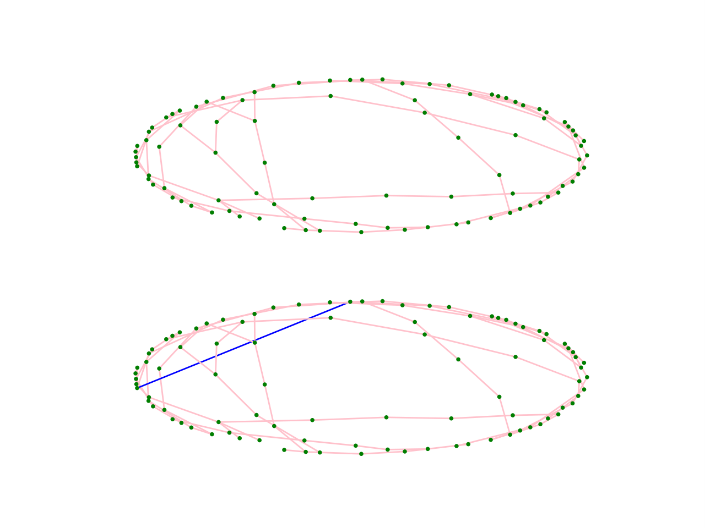

# graph-adversarial-attack


## Problem Statement
Graph structure plays an important role in many real-world applications. Deep learning on graph structures has shown exciting results in various applications, including drug screening, protein analysis, knowledge graph completion, etc. Despite the success of deep graph networks, the lack of interpretability and robustness of these models make it risky for some financial or security-related applications. For example, the graph information has been proven to be important in the area of risk management. A graph sensitive evaluation model will typically consider the user-user relationship: a user who connects with many high-credit users may also have high credit. Such heuristics learned by the deep graph methods would often yield good predictions, but could also put the model in a risk. A criminal could try to disguise himself by connecting other people using Facebook or Linkedin. Such an attack on the credit prediction model is quite cheap, but the consequence could be severe.

However, little attention has been paid to the robustness of such models, in contrast to numerous research work for image or text adversarial attack and defense. In this project, I focus on the graph adversarial attack for graph neural network (GNN) models. I intend to develop an interface that can help generate the adversarial graph given the original graph. And besides this, I also try to vividly visualize the difference between the original graph and the adversarial graph. Finally, I want to make it easy to be deployed on any platform. 


## Model & Approach
The model I use in this project is [strucutre2vec](https://arxiv.org/abs/1603.05629), which is an effective and scalable model for structured data representation based on the idea of embedding latent variable models into feature spaces and learning such feature spaces using discriminative information. Strucutre2vec extracts feature by performing a sequence of function mappings in a way similar to graphical model inference procedures, such as mean-field and belief propagation.

The adversarial approaches I use in this project include four. The first is RL-S2V. It can learn a Q-function parameterized by S2V to perform the attack. The second is RandSampling. This is the simplest attack method that randomly adds or deletes edges from the original graph. The third is GradArgmax. This is a white-box attack since it requires the gradient information, and the gradient considers all pairs of nodes in a graph. Fourth is GeneticAlg, which is a kind of evolutionary computing. It is an instantiation of the general genetic algorithm framework, and it is a black-box attack method.


## Input & Output
* Input: the original graphs
* Output: the modified graphs (i.e. the adversarial examples concerning the original graphs), as well as the comparison picture which depicts the modification caused by the adversarial attack (i.e. the structure difference between the original graph and the adversarial graph).


## Deliverables
* [Preprocessed graph data](https://github.com/kaigexie/graph-adversarial-attack/tree/master/dropbox/data)
* [Pretrained models](https://github.com/kaigexie/graph-adversarial-attack/tree/master/dropbox/scratch/results/graph_classification/components)
* Source codes for graph adversarial attack, adversarial graph generation and saving, graph modification visulization, and model deployment
* [Dockerfile for deployment](https://github.com/kaigexie/graph-adversarial-attack/blob/master/Dockerfile)
* [Docker Image ready to deploy](https://hub.docker.com/repository/docker/kaigexie1997/graph-adv-example)


## Run Graph Adversarial Attack (3 options)

### Option 1 - Run with Docker (using the docker image pulled from dockerhub):
#### 1. Pull the docker image from the dockerhub
```
docker pull kaigexie1997/graph-adv-example:latest
```
#### 2. Run the docker image as a docker container
```
docker container run kaigexie1997/graph-adv-example
```
### Option 2 - Run with Docker (using the docker image built from source)
#### 1. Clone this repo
```
git clone https://github.com/kaigexie/graph-adversarial-attack.git
```
#### 2. Enter the repo
```
cd graph-adversarial-attack
```
#### 3. Build the docker image from the Dockerfile
```
docker image build -t kaigexie1997/graph-adv-example .
```
#### 4. Run the docker image as a docker container
```
docker container run kaigexie1997/graph-adv-example
```
### Option 3 - Run from Source Code:
#### 1. Install Python 2.7 with Anaconda
```
wget https://repo.anaconda.com/archive/Anaconda2-2019.10-Linux-x86_64.sh
chmod +x Anaconda2-2019.10-Linux-x86_64.sh
./Anaconda2-2019.10-Linux-x86_64.sh
conda create -n python27 python=2.7
source activate python27
```
#### 2. Change CUDA version to 9.0
```
sudo rm /usr/local/cuda
sudo ln -s /usr/local/cuda-9.0 /usr/local/cuda
```
#### 3. Install PyTorch 0.3.1 for CUDA 9.0
```
wget https://download.pytorch.org/whl/cu90/torch-0.3.1-cp27-cp27mu-linux_x86_64.whl
pip install torch-0.3.1-cp27-cp27mu-linux_x86_64.whl
```
#### 4. Install NetworkX 1.11, tqdm, Matplotlib, SciPy, CFFI 1.11.2
```
conda install networkx=1.11
conda install tqdm
conda install matplotlib
conda install scipy
pip install cffi==1.11.2
```
#### 5. Enter the repo and run the bash script
```
cd graph-adversarial-attack
./get_attack_result.sh
```


## Model Training
To retrain the model, please make sure you have followed all the steps listed in Option 3 to install all necessary dependencies.
### Train the base model (our attack target)
```
cd graph-adversarial-attack/code/graph_classification
./run_er_components.sh -phase train
```
or
```
cd graph-adversarial-attack/code/node_classification
./run_gcn.sh -phase train
```
### Train the attacker (attack the above trained model)
```
cd graph-adversarial-attack/code/graph_attack
./run_dqn.sh -phase train
```
or
```
cd graph-adversarial-attack/code/node_attack
./run_attack.sh -phase train
```


## Deployment Via Amazon Elastic Compute Cloud (AWS EC2)
### 1. Launch a new EC2 instance
 - Amazon Machine Image (AMI): Deep Learning Base AMI (Ubuntu 16.04)
 
 - Instance Type: GPU instances g4dn.xlarge
 
 - Create and download a new key pair (named ```graph-adversarial-attack.pem```)

### 2. Connect to the EC2 instance
 - Find the EC2 instance's public DNS and copy it
 
 - Set the read permission for the owner
 ```
 chmod 0400 graph-adversarial-attack.pem
 ```
 - Use SSH to connect to the EC2 instance
 ```
 ssh -L localhost:8890:localhost:8890 -i graph-adversarial-attack.pem ubuntu@ec2-3-14-8-221.us-east-2.compute.amazonaws.com
 ```

### 3. Deployment
 - Follow the instruction in any one of the three options listed above


## Adversarial Visualization Example
After running the graph adversarial attack, the original graphs, the modified graphs (i.e. the adversarial examples concerning the original graphs), and the comparison picture which depicts the modification caused by the adversarial attack (i.e. the structure difference between the original graph and the adversarial graph) will be saved in ```data_dir```. The adversarial visualization will look like the picture displayed below.




## Reference
- [Discriminative Embeddings of Latent Variable Models for Structured Data](https://arxiv.org/abs/1603.05629)
- [Adversarial Attack on Graph Structured Data](https://arxiv.org/abs/1806.02371)
